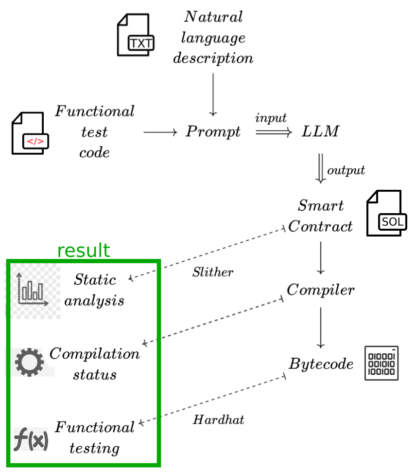

# Benchmarking Large Language Models for Ethereum Smart Contract Development
This project provides an automated pipeline to generate smart contracts using Large Language Models with [Ollama](https://www.ollama.com/). The pipeline compiles these smart contracts with the Solidity compiler (solc), analyzes them using [Slither](https://github.com/crytic/slither), and performs unit testing based on the provided test instructions in the prompts. Statistics are then produced to determine the efficiency of each model and various prompts are used to interpret the results.

## Pipeline architecture



## Prerequisites
- Ollama server running on localhost __HTTP__ port __11434__ (default) with the following pre-installed models : [llama3](https://ollama.com/library/llama3), [gemma](https://ollama.com/library/gemma), [mistral](https://ollama.com/library/mistral), [codegemma](https://ollama.com/library/codegemma), [codellama](https://ollama.com/library/codellama)
- Docker Compose to run the portable debian container

To modify the models used as well as the number of iterations, modify the constants of *pipeline.py*.

## Project Structure
```
.
├── analyze.py          # Script computing stats after the pipeline finishes
├── dataset.csv         # Dataset of prompts
├── docker-compose.yml
├── Dockerfile          # Dockerfile of the pipeline image
├── hardhat_test_env    # Hardhat project for testing
│   ├── hardhat.config.js
│   └── package.json
├── main.py             # Entry point
├── pipeline.py         # Pipeline script
├── README.md
└── solc-static-linux   # Solidity compiler binary
```

## Docker deployment
To build the Docker image and start the pipeline inside a container, run:
```bash
docker-compose up --build
```

To enter the pipeline container during the execution, run:
```bash
docker exec -it llm_bench /bin/bash
```

To get the output after the container exited, run:
```bash
docker cp llm_bench/:/app/output_pipeline.zip [DESTINATION_DIRECTORY]
```

## Using the output archive
After copying the output from the container into **[DESTINATION_DIRECTORY]**, follow these steps:
```bash
cd [DESTINATION_DIRECTORY]
unzip output_pipeline.zip
```

You can explore the generated files, here models are cited in prerequisites and *iteration = 1* per contract and model. 
```bash
tree output/
.
├── codegemma/
├── codellama/
├── data.json           # Pipeline result
├── extracted_tests/    # Tests for Hardhat
├── gemma/
├── llama3/
├── mistral/
└── stats.json          # Stats
```

## Built with
- [Ollama](https://github.com/ollama/ollama): Running large language models locally.
- [Slither, the smart contract static analyzer](https://github.com/crytic/slither): Slither is a Solidity & Vyper static analysis framework written in Python3.
- [The solidity compiler](https://github.com/ethereum/solc-bin): build by the Ethereum Foundation.
- [Hardhat](https://github.com/NomicFoundation/hardhat): Hardhat is an Ethereum development environment for professionals, Built by the Nomic Foundation.

Pipeline created in python, running inside a Docker container.

## Example results

### stats.json
```json
{
    "llama3": {
        "compilation": {
            "ok": 6,
            "ko": 4, // 4/10 contracts don't compile
            "ratio": 60.0
        },
        "zeroVulnerability": 4, // 4/6 generated contracts don't have low, medium, or high vulnerabilities with slither. 
        "vulnerability": {
            "Low": 2, // 2/6 generated contracts contain 1 low vulnerability
            "Medium": 0,
            "High": 1,
            "Informational": 12,
            "Optimization": 4
        },
        "perfectTests": 2, // 2/6 contracts pass all unit tests
        "totalRatio": 74.30555555555556, // average percentage of tests passed by contracts (among contracts that compile).
        "PerfectContract": 1, // 1/10 compiled, without vulnerability and passed all the tests.
        "details": {
            "ComplexStorage": {
                ... // details for every iteration with 'ComplexStorage'
            }, ...
```

### data.json
```json
{
    "llama3": {
        "ComplexStorage": {
            "0": {
                "compilation": {
                    "returnCode": 1,
                    "stdout": "",
                    "stderr": "Error: Source \"https://github.com/OpenZeppelin/openzeppelin-solidity/contracts/access/Ownable.sol\" not found: File not found. Searched the following locations: \"\".\n --> output/llama3/ComplexStorage/0.sol:4:1:\n  |\n4 | import \"https://github.com/OpenZeppelin/openzeppelin-solidity/contracts/access/Ownable.sol\";\n  | ^^^^^^^^^^^^^^^^^^^^^^^^^^^^^^^^^^^^^^^^^^^^^^^^^^^^^^^^^^^^^^^^^^^^^^^^^^^^^^^^^^^^^^^^^^^^\n\n"
                },
                "slither": {
                    "returnCode": 1,
                    "stdout": "",
                    "stderr": "'solc --version' running\n'solc output/llama3/ComplexStorage/0.sol --combined-json abi,ast,bin,bin-runtime,srcmap,srcmap-runtime,userdoc,devdoc,hashes --allow-paths .,/app/output/llama3/ComplexStorage' running\nCompilation warnings/errors on output/llama3/ComplexStorage/0.sol:\nError: Source \"https://github.com/OpenZeppelin/openzeppelin-solidity/contracts/access/Ownable.sol\" not found: File not found. Searched the following locations: \"\".\n --> output/llama3/ComplexStorage/0.sol:4:1:\n  |\n4 | import \"https://github.com/OpenZeppelin/openzeppelin-solidity/contracts/access/Ownable.sol\";\n  | ^^^^^^^^^^^^^^^^^^^^^^^^^^^^^^^^^^^^^^^^^^^^^^^^^^^^^^^^^^^^^^^^^^^^^^^^^^^^^^^^^^^^^^^^^^^^\n\n\nTraceback (most recent call last):\n  File \"/app/venv/lib/python3.11/site-packages/crytic_compile/platform/solc.py\", line 582, in _run_solc\n    ret: Dict = json.loads(stdout)\n                ^^^^^^^^^^^^^^^^^^\n  File \"/usr/lib/python3.11/json/__init__.py\", line 346, in loads\n    return _default_decoder.decode(s)\n           ^^^^^^^^^^^^^^^^^^^^^^^^^^\n  File \"/usr/lib/python3.11/json/decoder.py\", line 337, in decode\n    obj, end = self.raw_decode(s, idx=_w(s, 0).end())\n               ^^^^^^^^^^^^^^^^^^^^^^^^^^^^^^^^^^^^^^\n  File \"/usr/lib/python3.11/json/decoder.py\", line 355, in raw_decode\n    raise JSONDecodeError(\"Expecting value\", s, err.value) from None\njson.decoder.JSONDecodeError: Expecting value: line 1 column 1 (char 0)\n\nDuring handling of the above exception, another exception occurred:\n\nTraceback (most recent call last):\n  File \"/app/venv/bin/slither\", line 8, in <module>\n    sys.exit(main())\n             ^^^^^^\n  File \"/app/venv/lib/python3.11/site-packages/slither/__main__.py\", line 753, in main\n    main_impl(all_detector_classes=detectors, all_printer_classes=printers)\n  File \"/app/venv/lib/python3.11/site-packages/slither/__main__.py\", line 859, in main_impl\n    ) = process_all(filename, args, detector_classes, printer_classes)\n        ^^^^^^^^^^^^^^^^^^^^^^^^^^^^^^^^^^^^^^^^^^^^^^^^^^^^^^^^^^^^^^\n  File \"/app/venv/lib/python3.11/site-packages/slither/__main__.py\", line 96, in process_all\n    compilations = compile_all(target, **vars(args))\n                   ^^^^^^^^^^^^^^^^^^^^^^^^^^^^^^^^^\n  File \"/app/venv/lib/python3.11/site-packages/crytic_compile/crytic_compile.py\", line 722, in compile_all\n    compilations.append(CryticCompile(target, **kwargs))\n                        ^^^^^^^^^^^^^^^^^^^^^^^^^^^^^^^\n  File \"/app/venv/lib/python3.11/site-packages/crytic_compile/crytic_compile.py\", line 211, in __init__\n    self._compile(**kwargs)\n  File \"/app/venv/lib/python3.11/site-packages/crytic_compile/crytic_compile.py\", line 633, in _compile\n    self._platform.compile(self, **kwargs)\n  File \"/app/venv/lib/python3.11/site-packages/crytic_compile/platform/solc.py\", line 151, in compile\n    targets_json = _get_targets_json(compilation_unit, self._target, **kwargs)\n                   ^^^^^^^^^^^^^^^^^^^^^^^^^^^^^^^^^^^^^^^^^^^^^^^^^^^^^^^^^^^\n  File \"/app/venv/lib/python3.11/site-packages/crytic_compile/platform/solc.py\", line 280, in _get_targets_json\n    return _run_solc(\n           ^^^^^^^^^^\n  File \"/app/venv/lib/python3.11/site-packages/crytic_compile/platform/solc.py\", line 586, in _run_solc\n    raise InvalidCompilation(f\"Invalid solc compilation {stderr}\")\ncrytic_compile.platform.exceptions.InvalidCompilation: Invalid solc compilation Error: Source \"https://github.com/OpenZeppelin/openzeppelin-solidity/contracts/access/Ownable.sol\" not found: File not found. Searched the following locations: \"\".\n --> output/llama3/ComplexStorage/0.sol:4:1:\n  |\n4 | import \"https://github.com/OpenZeppelin/openzeppelin-solidity/contracts/access/Ownable.sol\";\n  | ^^^^^^^^^^^^^^^^^^^^^^^^^^^^^^^^^^^^^^^^^^^^^^^^^^^^^^^^^^^^^^^^^^^^^^^^^^^^^^^^^^^^^^^^^^^^\n\n\n"
                },
                "testing": {
                    "returnCode": 1,
                    "stdout": "\n",
                    "stderr": "Error HH406: Invalid import https://github.com/OpenZeppelin/openzeppelin-solidity/contracts/access/Ownable.sol from contracts/contract.sol. Hardhat doesn't support imports via https.\nHardhatError: HH406: Invalid import https://github.com/OpenZeppelin/openzeppelin-solidity/contracts/access/Ownable.sol from contracts/contract.sol. Hardhat doesn't support imports via https.\n    at Resolver.resolveImport (/app/hardhat_test_env/node_modules/hardhat/src/internal/solidity/resolver.ts:133:13)\n    at /app/hardhat_test_env/node_modules/hardhat/src/internal/solidity/dependencyGraph.ts:188:28\n    at async Promise.all (index 0)\n    at DependencyGraph._addDependenciesFrom (/app/hardhat_test_env/node_modules/hardhat/src/internal/solidity/dependencyGraph.ts:186:5)\n    at async Promise.all (index 0)\n    at Function.createFromResolvedFiles (/app/hardhat_test_env/node_modules/hardhat/src/internal/solidity/dependencyGraph.ts:15:5)\n    at Environment._runTaskDefinition (/app/hardhat_test_env/node_modules/hardhat/src/internal/core/runtime-environment.ts:359:14)\n    at Environment.run (/app/hardhat_test_env/node_modules/hardhat/src/internal/core/runtime-environment.ts:192:14)\n    at SimpleTaskDefinition.action (/app/hardhat_test_env/node_modules/hardhat/src/builtin-tasks/compile.ts:1389:58)\n    at Environment._runTaskDefinition (/app/hardhat_test_env/node_modules/hardhat/src/internal/core/runtime-environment.ts:359:14)\n"
                },
                "response": "Here is the Solidity smart contract that manages and interacts with user and product data:\n```\npragma solidity ^0.8.0;\n\nimport \"https://github.com/OpenZeppelin/openzeppelin-solidity/contracts/access/Ownable.sol\";\n\ncontract ComplexStorage {\n    struct UserProfile {\n        string name;\n        uint age;\n    }\n\n    struct Product {\n        string name;\n        uint price;\n        bool isAvailable;\n    }\n\n    mapping (address => UserProfile) public userProfiles;\n    mapping (uint => Product) public products;\n\n    event NewUserRegistered(address indexed user);\n    event NewProductAdded(string indexed productName, uint indexed productPrice);\n\n    address public owner;\n\n    constructor() {\n        owner = msg.sender;\n    }\n\n    function registerUser(string memory _name, uint _age) public {\n        require(msg.sender != address(0), \"Only valid addresses can register\");\n        userProfiles[msg.sender] = UserProfile(_name, _age);\n        emit NewUserRegistered(msg.sender);\n    }\n\n    function getUserProfile(address _userAddress) public view returns (string memory, uint) {\n        require(userProfiles[_userAddress].name != \"\", \"User profile not found\");\n        return (userProfiles[_userAddress].name, userProfiles[_userAddress].age);\n    }\n\n    function addProduct(string memory _productName, uint _productPrice) public onlyOwner {\n        products[products.length] = Product(_productName, _productPrice, true);\n        emit NewProductAdded(_productName, _productPrice);\n    }\n\n    modifier onlyOwner() {\n        require(msg.sender == owner, \"Only the contract owner can perform this action\");\n        _;\n    }\n\n    function pause() public onlyOwner {\n        owner = address(0);\n    }\n}\n```\nNote that I used OpenZeppelin's `Ownable` contract to implement the `onlyOwner` modifier. This allows us to restrict certain functions to be called only by the contract owner.",
                "promptInfos": {
                    "created_at": "2024-06-12T08:13:34.815555531Z",
                    "done": true,
                    "done_reason": "stop",
                    "total_duration": 71677520960,
                    "load_duration": 4961628553,
                    "prompt_eval_count": 520,
                    "prompt_eval_duration": 16619119000,
                    "eval_count": 396,
                    "eval_duration": 50053781000
                }
            }
        },
        "Escrow": ...
```

### Content of output/codegemma
 ```
 .
├── codegemma
│   ├── ComplexStorage
│   │   ├── 0.sol # cleaned response (regexp sol code + licence)
│   │   └── 0.txt # response it=0
│   ├── Escrow
│   │   ├── 0.sol
│   │   └── 0.txt
│   ├── ...
```

## License
This project is licensed under the GNU GENERAL PUBLIC LICENSE.

See the "LICENSE.txt" file for more details or [https://spdx.org/licenses/GPL-3.0-only.html](https://spdx.org/licenses/GPL-3.0-only.html)